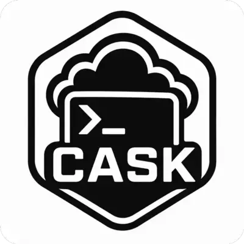

# CASK



- [CASK](#cask)
  - [Installation via Homebrew (MacOS/Linux - x86\_64/arm64)](#installation-via-homebrew-macoslinux---x86_64arm64)
  - [Download and Run Binary](#download-and-run-binary)
  - [Build and Run Binary](#build-and-run-binary)
  - [Configuration](#configuration)
    - [Obtaining your Cloudflare Account ID and API token](#obtaining-your-cloudflare-account-id-and-api-token)
    - [Writing the config file](#writing-the-config-file)
  - [Example Usage](#example-usage)

Cloudflare ASK (CASK) is a Go binary for asking Cloudflare Workers AI (Llama 3.1 8B Instruct Fast) for shell command suggestions, git command suggestions, or quick answers to general technical questions, straight from the terminal.

## Installation via Homebrew (MacOS/Linux - x86_64/arm64)

Installing with the fully-qualified name trusts only this cask, so it works as-is under Homebrew's [tap trust](https://docs.brew.sh/Tap-Trust) system:

```bash
brew install stenstromen/tap/cask
```

If you prefer to tap first and install by short name, explicitly trust the cask before installing (required in Homebrew 6.0.0 / 5.2.0 and later):

```bash
brew tap stenstromen/tap
brew trust --cask stenstromen/tap/cask
brew install cask
```

You can also trust the whole tap with `brew trust stenstromen/tap`, but trusting only the cask you need is recommended.

## Download and Run Binary

- For **MacOS** and **Linux**: Checkout and download the latest binary from [Releases page](https://github.com/Stenstromen/cask/releases/latest/)
- For **Windows**: Build the binary yourself.

## Build and Run Binary

```bash
go build
./cask
```

## Configuration

`cask` reads its Cloudflare credentials from a YAML config file. The file location is resolved in the following order:

1. `--config <path>` flag
2. `CASKCONFIG` environment variable (must be an absolute path)
3. `~/.cask.yaml` (default)

### Obtaining your Cloudflare Account ID and API token

You need a free [Cloudflare account](https://dash.cloudflare.com/sign-up) to use Workers AI.

1. Sign in to the [Cloudflare dashboard](https://dash.cloudflare.com/) and open the [Workers AI](https://dash.cloudflare.com/?to=/:account/ai/workers-ai) page.
2. Click **Use REST API**.
3. **Get your Account ID** — copy the value shown under *Get Account ID* and save it for the config file.
4. **Create your API token** — click *Create a Workers AI API Token*, review the prefilled permissions, click *Create API Token*, then *Copy API Token*. The token is only shown once.

The "Workers AI" API token template grants the minimum permissions required to call the `/ai/run/*` endpoint:

| Scope   | Permission         | Access |
| ------- | ------------------ | ------ |
| Account | `Workers AI`       | Read   |
| Account | `Workers AI`       | Edit   |

If you prefer to create a [custom token](https://dash.cloudflare.com/profile/api-tokens) instead of using the template, add both `Workers AI - Read` and `Workers AI - Edit` permissions on the account that owns the Account ID above. No zone or user permissions are needed.

### Writing the config file

Create the file using `config.example.yaml` as a template:

```yaml
---
cloudflare_account_id: YOUR_CLOUDFLARE_ACCOUNT_ID
cloudflare_api_key: YOUR_CLOUDFLARE_API_KEY
```

Treat this file like any other secret — it grants access to your Cloudflare account's Workers AI usage. A sensible default is `chmod 600 ~/.cask.yaml`.

## Example Usage

```bash
cask query --shell "find all files larger than 100MB in the current directory"
cask query --git "revert the last commit"
cask query --miscellaneous "what is the difference between docker compose and docker stack?"

---

Cloudflare ASK

Usage:
  cask [command]

Available Commands:
  completion  Generate the autocompletion script for the specified shell
  help        Help about any command
  query       Suggest shell commands or ask technical questions

Flags:
      --config string   Path to config file (overrides CASKCONFIG and ~/.cask.yaml)
  -h, --help            help for cask

Use "cask [command] --help" for more information about a command.
```
